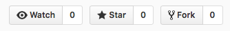

**rezistam.ro** e o arhiva online a protestelor din Piata Victoriei.  
Acest site este gazduit pe [GitHub Pages](https://github.com/rezistam/rezistam.github.io) si este open-source.  

### Prefata

Pentru a contribui este necesar un cont [GitHub](https://github.com/). 

### Instructiuni

1. Vizitati pagina [site-ului](https://github.com/rezistam/rezistam.github.io)
2. Din meniul  selectati optiunea **`Fork`**[^fork]  
3. Pentru un nou articol pe blog, creati un nou fisier in directorul **`_posts`**:  [^file]  [^name]
4. La inceputul fiecarui articol trebuie sa adaugati cateva informatii suplimentare: [^post]  

	`---`  
	`layout: post`  
	`title: Titlu articol`  
	`date: 2017-02-01`  
	`---`  
 [^info]
5. Textul trebuie introdus urmarind specificatiile [MarkDown][md]
6. Selectati **Preview** din meniul ![preview]
7. La final, selectati **Create new branch** din meniul:  
![commit]
8. Pentru a finaliza, faceti click pe butonul **`Propose new file`**

[^fork]: Mai multe informatii (*in engleza*) pe [site-ul GitHub](https://help.github.com/articles/fork-a-repo/)
[^file]: Mai multe informatii (*in engleza*) pe [site-ul GitHub](https://github.com/blog/1327-creating-files-on-github) 
[^name]: Pentru consistenta, numele fisierului trebuie sa fie in formatul: `ANUL-LUNA-ZIUA-Titlu.md`
[^post]: Mai multe informatii (*in engleza*) despre [articole blog](https://jekyllrb.com/docs/posts/)
[^info]: Copiati textul si modificati doar titlul si data
[md]: https://guides.github.com/features/mastering-markdown/#examples "MarkDown"
[preview]: images/preview.png
[commit]:images/commit.png